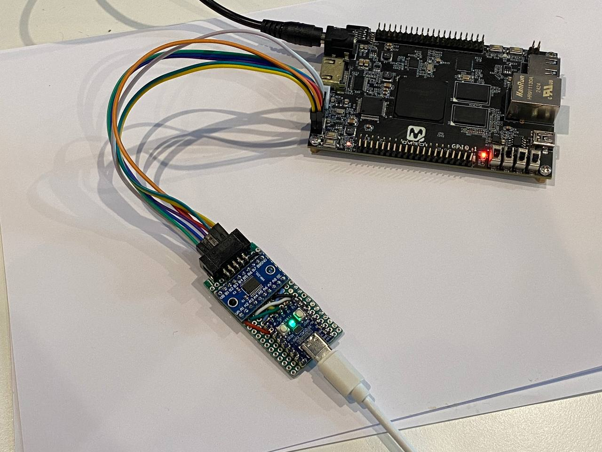
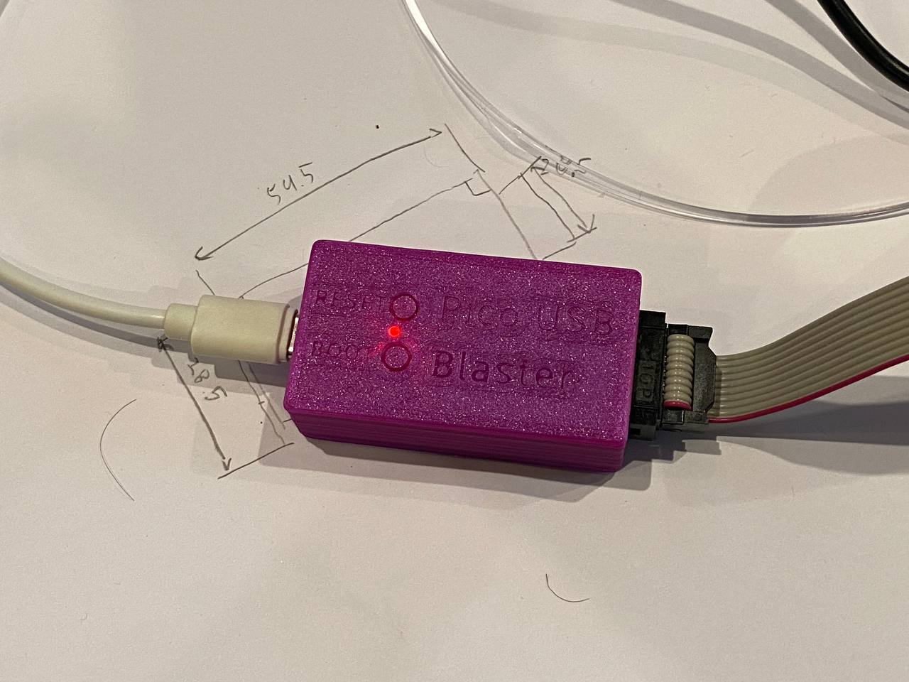

# Pico USB Blaster
This firmware turns your Raspberry Pi Pico (or other RP2040/RP2350-based board) 
into an **Altera USB-blaster / Intel FPGA Download Cable**-compatible JTAG/AS/PS programmer usable with Quartus, OpenOCD, etc.

The project relies only on **tinyUSB** stack, so it also should be also easily portable to any **tinyUSB**-capable device

## How-to


### Required parts
* Raspberry Pi Pico or Pico 2 / another RP2040/RP2350 board
* if non-3.3V operation required - adequate fast level shifter capable of [loading 1k TCK pulldown](https://www.intel.com/content/www/us/en/docs/programmable/683546/current/pull-up-and-pull-down-of-jtag-pins-during.html)
* i tested TXS0108E i had, and while it works, i can't recommend it (if 1k pulldown is present), because TCK quickly drops to ~2v instead of steady 3.3v

### Flashing
* Get latest release uf2 or build your own:
  ```
  /src$       mkdir build
  /src$       cd build
  /src/build$ cmake ..
  /src/build$ make pico_usb_blaster
  ```
* Press BOOTSEL, connect USB and drop uf2 there

### Pinout
Default TCK/DCLK pin is GP11 ([blaster.c](./src/blaster.c))
```
#define TCK_DCLK_PIN        11
```

Other data pins for simplicity are mapped sequentially relative to TCK/DCLK
```
GPIO  | I/O | name            | JTAG | AS        | PS
------+-----+-----------------+------+-----------+-----------
11    | O   | TCK_DCLK        | TCK  | DCLK      | DCLK
12    | O   | TMS_nCONFIG     | TMS  | nCONFIG   | nCONFIG
13    | O   | nCE             | -    | nCE       | -
14    | O   | nCS             | -    | nCS       | -
15    | O   | TDI_ASDI        | TDI  | ASDI      | DATA0 
16    | I   | TDO_CONF_DONE   | TDO  | CONF_DONE | CONF_DONE
17    | I   | DATAOUT_nSTATUS | -    | DATAOUT   | nSTATUS
```

GP0 is debug UART TX, GP25 (onbooard LED) is used as an output enable / activity LED

### Drivers
Follow the 'Installing the Intel FPGA Download Cable Driver' instruction from Intel website

The device replicates the overall USB-Blaster USB descriptor structure and pretends to have the same VID&PID for the drivers to be compatible.
The board-unique serial is provided by the **tinyUSB** bsp:
```
Bus 001 Device 003: ID 09fb:6001 Altera Blaster
Device Descriptor:
  bLength                18
  bDescriptorType         1
  bcdUSB               1.10
  bDeviceClass            0
  bDeviceSubClass         0
  bDeviceProtocol         0
  bMaxPacketSize0         8
  idVendor           0x09fb Altera
  idProduct          0x6001 Blaster
  bcdDevice            4.00
  iManufacturer           1 Pico
  iProduct                2 USB Blaster
  iSerial                 3 e6613893
  bNumConfigurations      1
  Configuration Descriptor:
    bLength                 9
    bDescriptorType         2
    wTotalLength       0x0020
    bNumInterfaces          1
    bConfigurationValue     1
    iConfiguration          0
    bmAttributes         0x80
      (Bus Powered)
    MaxPower              150mA
    Interface Descriptor:
      bLength                 9
      bDescriptorType         4
      bInterfaceNumber        0
      bAlternateSetting       0
      bNumEndpoints           2
      bInterfaceClass       255 Vendor Specific Class
      bInterfaceSubClass    255 Vendor Specific Subclass
      bInterfaceProtocol    255 Vendor Specific Protocol
      iInterface              0
      Endpoint Descriptor:
        bLength                 7
        bDescriptorType         5
        bEndpointAddress     0x81  EP 1 IN
        bmAttributes            2
          Transfer Type            Bulk
          Synch Type               None
          Usage Type               Data
        wMaxPacketSize     0x0040  1x 64 bytes
        bInterval               0
      Endpoint Descriptor:
        bLength                 7
        bDescriptorType         5
        bEndpointAddress     0x02  EP 2 OUT
        bmAttributes            2
          Transfer Type            Bulk
          Synch Type               None
          Usage Type               Data
        wMaxPacketSize     0x0040  1x 64 bytes
        bInterval               0
Device Status:     0x0000
  (Bus Powered)
```

### Usage
Now you can program Intel/Altera JTAG/AS/PS devices with Quartus or use it as a generic JTAG-adapter (where USB-Blaster is supported)

Unfortunately i can't confirm AS/PS operation, because i don't have such devices around, 
but looking at the protocol there should be no issues in theory

## Prettier version
I found RP2040-zero board the perfect size for an assembled device and also added a TXS0108E (see 'Required parts' for concerns regarding this exact level-shifter)

This setup uses onboard ws2812 rgb led (support included), pins 8-14 as data I/O and pin 15 as shifter output enable



And a 3D-printable enclosure. Instructions, STLs and a Fusion 360 source file are [here](./3d_print/)




## Credits
* Protocol description, specs, FT245 EEPROM taken from
[Teensy_Blaster](https://github.com/Memotech-Bill/Teensy_Blaster/),
[usbd-blaster](https://github.com/sameer/usbd-blaster) and 20-year old forum posts
* WS2812 PIO code taken from [pico-examples](https://github.com/raspberrypi/pico-examples)
