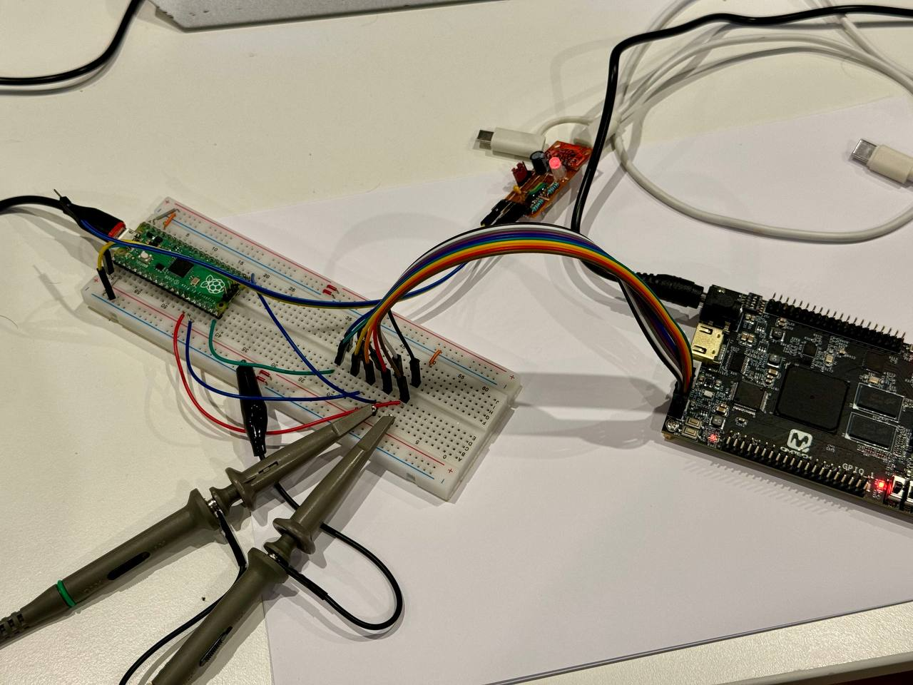

# Pico USB Blaster
This firmware turns your Raspberry Pi Pico (or other RP2040/RP2350-based board) 
into an **Altera USB-blaster / Intel FPGA Download Cable**-compatible JTAG/AS/PS programmer usable with Quartus, OpenOCD, etc.

The project relies only on **tinyUSB** stack, so it also should be also easily portable to any **tinyUSB**-capable device

## How-to


### Required parts
* Raspberry Pi Pico or Pico 2 / another RP2040/RP2350 board
* if non-3.3V operation required - adequate level shifter, TXS0108E is perfect for the task

### Flashing
* Get latest release uf2 or build your own:
  ```
  /src$       mkdir build
  /src$       cd build
  /src/build$ cmake ..
  /src/build$ make pico_usb_blaster
  ```
* Press BOOTSEL, connect USB and drop uf2 there

### Pinout
Default TCK/DCLK pin is GP11 ([blaster.c](./src/blaster.c))
```
#define TCK_DCLK_PIN        11
```

Other data pins for simplicity are mapped sequentially relative to TCK/DCLK
```
GPIO  | I/O | name            | JTAG | AS        | PS
------+-----+-----------------+------+-----------+-----------
11    | O   | TCK_DCLK        | TCK  | DCLK      | DCLK
12    | O   | TMS_nCONFIG     | TMS  | nCONFIG   | nCONFIG
13    | O   | nCE             | -    | nCE       | -
14    | O   | nCS             | -    | nCS       | -
15    | O   | TDI_ASDI        | TDI  | ASDI      | DATA0 
16    | I   | TDO_CONF_DONE   | TDO  | CONF_DONE | CONF_DONE
17    | I   | DATAOUT_nSTATUS | -    | DATAOUT   | nSTATUS
```

GP0 is debug UART TX, GP25 (onbooard LED) is used as an output enable / activity LED

### Drivers
Follow the 'Installing the Intel FPGA Download Cable Driver' instruction from Intel website

### Usage
Now you can program Intel/Altera JTAG/AS/PS devices with Quartus or use it as a generic JTAG-adapter (where USB-Blaster is supported)

Unfortunately i can't confirm AS/PS operation, because i don't have such devices around, 
but looking at the protocol there should be no issues in theory

## Credits
* Protocol description, specs, FT245 EEPROM taken from
[Teensy_Blaster](https://github.com/Memotech-Bill/Teensy_Blaster/),
[usbd-blaster](https://github.com/sameer/usbd-blaster) and 20-year old forum posts
